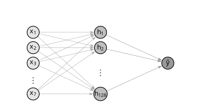

# Predição de Gasto Calórico em Atividades Fı́sicas Utilizando Redes Neurais Artificiais Perceptron Multicamadas

<div align="center">


</div>

---

## 📌 Visão geral

Este repositório apresenta um modelo de regressão para estimar o gasto calórico em atividades físicas. A abordagem utiliza uma Rede Neural Artificial MLP (Multilayer Perceptron), treinada com variáveis físicas e de exercício, como idade, altura, peso, duração, frequência cardíaca, temperatura corporal e sexo.

O objetivo é prever, com boa aproximação, a quantidade de calorias queimadas com base em dados observados de pessoas em atividades físicas.

## 📊 Dados utilizados

Os dados foram obtidos a partir do dataset `fmendes-DAT263x-demos`, disponibilizada via Kaggle, 

- [Acesse o dataset](https://www.kaggle.com/datasets/fmendes/fmendesdat263xdemos)

---

## 📄 Documento principal

- [Visualizar / baixar o PDF do estudo](Predição_de_Gasto_Calórico_em_Atividades_Físicas_Utilizando_Redes_Neurais_Artificiais_do_Tipo_MLP.pdf)
---

## 📁 Estrutura do projeto

```text
Caloric-Expenditure-Prediction/
├── README.md
├── caloricExpenditurePrediction.ipynb
├── Predição_de_Gasto_Calórico_em_Atividades_Físicas_Utilizando_Redes_Neurais_Artificiais_do_Tipo_MLP.pdf
├── model/
│   └── mlpPreditivaGastoCalorico.keras
└── .git/
```

---

## 🏗️ Arquitetura da rede neural

<p align="center">
  
</p>

---

## 📈 Métricas de avaliação

O modelo foi avaliado com métricas clássicas de regressão:

- MSE (Mean Squared Error)
- MAE (Mean Absolute Error)
- RMSE (Root Mean Squared Error)
- R² (coeficiente de determinação)

---

## 📌 Observações

- projeto desenvolvido como estudo prático de aplicação de redes neurais em regressão
- o notebook e o trabalho escrito são os principais artefato para reprodução do experimento
- o modelo treinado pode ser reutilizado, ajustado e expandido para outros cenários

---

## 🤝 Contribuições

Contribuições são bem-vindas. Você pode:

- ajustar a arquitetura da rede
- explorar novas métricas de avaliação
- melhorar a análise explicativa
- testar outros algoritmos de regressão
- aprimorar a documentação do projeto

## 🔗 Acesso rápido

- [Notebook principal](caloricExpenditurePrediction.ipynb)
- [Modelo treinado](model/mlpPreditivaGastoCalorico.keras)
- [Trabalho escrito](Predição_de_Gasto_Calórico_em_Atividades_Físicas_Utilizando_Redes_Neurais_Artificiais_do_Tipo_MLP.pdf)
- [Dataset utilizado](https://www.kaggle.com/datasets/fmendes/fmendesdat263xdemos)